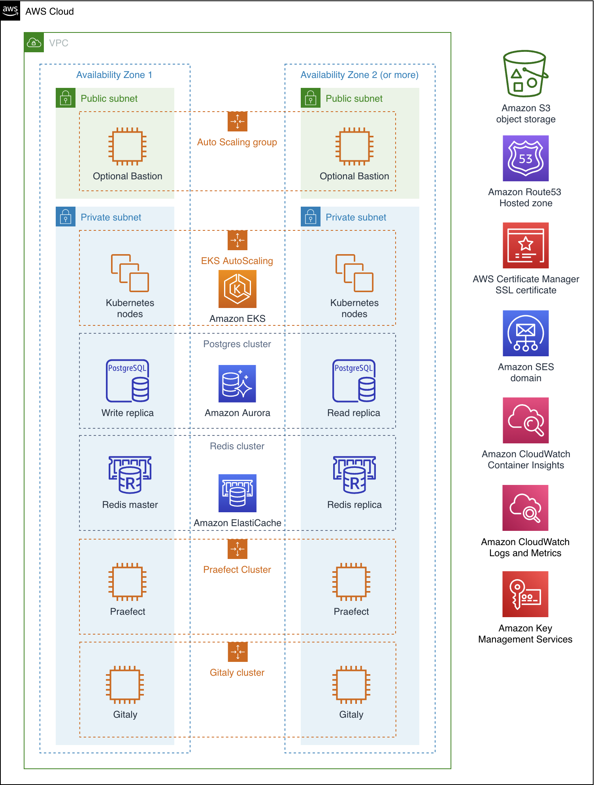

Deploying this Quick Start for a new virtual private cloud (VPC) with
default parameters builds the following {partner-product-short-name} environment in the
AWS Cloud.

// Replace this example diagram with your own. Send us your source PowerPoint file. Be sure to follow our guidelines here : http://(we should include these points on our contributors giude)
:xrefstyle: short
[#architecture1]
.Quick Start architecture for {partner-product-short-name} on AWS

As shown in <<architecture1>>, the Quick Start sets up the following:

* A highly available architecture that spans two or three Availability Zones.
* A VPC configured with public and private subnets, according to AWS
best practices, to provide you with your own virtual network on AWS.^1^
* An Amazon EKS cluster, which creates the Kubernetes control plane.^2^
* S3 buckets for GitLab object storage
* In the public subnets:
** Managed network address translation (NAT) gateways to allow outbound
internet access for resources in the private subnets.^1^
* In the private subnets:
** A group of Kubernetes EC2 nodes.^2^
** An Amazon RDS cluster fot GitLab and Praefect databases.
* Optionally:
** In one public subnet, a Linux bastion host in an Auto Scaling group to allow 
inbound Secure Shell (SSH) access to Amazon Elastic Compute Cloud (Amazon EC2) 
instances in private subnets. The bastion host is also configured with the Kubernetes 
`kubectl` command line interface (CLI) for managing the Kubernetes cluster.
** Amazon Route53 Hosted zone for DNS configuration
** AWS Certificate Manager TLS certificate
** Amazon Simple Email Service domain for outgoing email messages
** Amazon CloudWatch Container Insights integration 

[.small]#^1^The template that deploys the Quick Start into an existing VPC skips 
the components and prompts you for your existing VPC configuration.#

[.small]#^2^The template that deploys the Quick Start into an existing EKS cluster skips
the components and prompts you for your existing EKS configuration.#

=== Database Cluster
GitLab Quickstart deploys Highly Available PostgreSQL database cluster using https://aws.amazon.com/quickstart/architecture/aurora-postgresql/[Amazon Aurora PostgreSQL Quickstart^].

Depending on the projected size of your GitLab deployment you may want to adjust database instance size using *DBInstanceClass* parameter.

There are two databases deployed to the same cluster:

* GitLab database
* Praefect tracking database

Praefect requires a separate tracking database as described in https://docs.gitlab.com/ee/administration/gitaly/praefect.html[Gitaly Cluster documentation^]. 

More about external database configuration in https://docs.gitlab.com/charts/advanced/external-db/[GitLab documentation^].

=== Object storage
GitLab Quickstart creates the following S3 buckets:

* ArtifactsBucket
* LfsBucket
* UploadsBucket
* PackagesBucket
* TerraformBucket
* PseudonymizerBucket
* RegistryBucket
* BackupBucket
* BackupTempBucket

Contents of the bucket encrypted by default with SSE-S3. Names of the buckets are generated by CloudFormation and exported as SSM parameters (see *Exports* section).

More about external object storage in https://docs.gitlab.com/charts/advanced/external-object-storage/[GitLab documentation^].

=== Backups

==== Schedule

Backup schedule is controlled by cron expression and default value is `pass:[0 1 * * * *]` (daily at 1am). You can set a different schedule using *BackupSchedule* parameter.

==== Content of the backups

Backups include GitLab database snapshot and contents of GitLab projects (Git repositories, Wiki pages). Backups do *not* include contents of S3 buckets (see Object storage for a list of buckets). The main reason behind this decision:

* Contents of these buckets may be very large (pipeline artifacts, docker images, etc.) and that may affect stability and performance of the backup jobs
* S3 is a https://aws.amazon.com/s3/faqs/#Durability_.26_Data_Protection[durable storage^] 

If needed, complete backup may be created using backup-utility as described in https://docs.gitlab.com/charts/backup-restore/[GitLab documentation^].

==== Backup/Restore resources 

NOTE: Disk volume required for backups is about *2x larger than backup tarball itself*. This is due to the fact that all resources have to be downloaded first and packaged to tarball file which also stored locally. Consider the size of you GitLab database and projects (mainly Git repositories) to set the size of the underlying EBS volumes appropriately using *BackupVolumeSize* parameter.

Default Quick Start configuration tested on backups of 20Gb average size, took about 30 minutes to create and upload to S3 bucket.

For large GitLab deployments you can also adjust CPU and memory requirements for backup and restore pods using *BackupCpu* and *BackupMemory* parameters.

More about backups in https://docs.gitlab.com/charts/backup-restore/[GitLab documentation^].

=== Telemetry
==== CloudWatch Container Insights
GitLab Quickstart integrates EKS cluster with https://docs.aws.amazon.com/AmazonCloudWatch/latest/monitoring/ContainerInsights.html[CloudWatch Container Insights^] to collect, aggregate, and summarise metrics and logs if *ConfigureContainerInsights* parameter is set to `Yes`.

Logs and metrics can be accessed from CloudWatch console:

:xrefstyle: short
[#cloudwatch-container-insights]
.CloudWatch Container Insights
image::../images/cloudwatch-container-insights.png[CloudWatch Container Insights,width=100%,height=100%]

==== Prometheus metrics
GitLab exposes Prometheus metrics under `/-/metrics` of the GitLab Ingress. Optional Grafana integration can be enabled by setting *ConfigureGrafana* parameter to ‘Yes’. 

:xrefstyle: short
[#grafana]
.Grafana
image::../images/grafana.png[Grafana,width=100%,height=100%]

More about Grafana integration in https://docs.gitlab.com/charts/charts/globals.html#configure-grafana-integration[GitLab documentation^].

==== Amazon EKS Console
Amazon EKS Console gives you a single place to see the status of your Kubernetes clusters, applications, and associated cloud resources.

Please see the prerequisites for Amazon EKS Console access configuration in https://docs.aws.amazon.com/eks/latest/userguide/view-workloads.html[AWS documentation^]. 

:xrefstyle: short
[#aws-eks-console]
.AWS EKS Console
image::../images/aws-eks-console.png[AWS EKS Console,width=100%,height=100%]

=== Exports
Upon successful GitLab deployment, the following SSM parameters and Secrets Manages secrtes are exposed: 

.SSM parameters
[cols="3,1,2"]
|===
|Name | Type | Description 

|/quickstart/gitlab/`{env-name}`/infra/domain-name
|SSM
|GitLab domain name

|/quickstart/gitlab/`{env-name}`/infra/hosted-zone-id
|SSM
|GitLab Route53 hosted zone ID

|/quickstart/gitlab/`{env-name}`/infra/hosted-zone-name
|SSM
|GitLab Route53 hosted zone name

|/quickstart/gitlab/`{env-name}`/cluster/name
|SSM
|EKS Cluster name

|/quickstart/gitlab/`{env-name}`/storage/buckets/artifacts
|SSM
|S3 Artifacts bucket name 

|/quickstart/gitlab/`{env-name}`/storage/buckets/backup
|SSM
|S3 Backup bucket name 

|/quickstart/gitlab/`{env-name}`/storage/buckets/backup-tmp
|SSM
|S3 Backup Temp bucket name 

|/quickstart/gitlab/`{env-name}`/storage/buckets/lfs
|SSM
|S3 LFS bucket name 

|/quickstart/gitlab/`{env-name}`/storage/buckets/packages
|SSM
|S3 Packages bucket name 

|/quickstart/gitlab/`{env-name}`/storage/buckets/pseudonymizer
|SSM
|S3 Pseudonymizer bucket name 

|/quickstart/gitlab/`{env-name}`/storage/buckets/registry
|SSM
|S3 Registry bucket name 

|/quickstart/gitlab/`{env-name}`/storage/buckets/terraform
|SSM
|S3 Terraform bucket name 

|/quickstart/gitlab/`{env-name}`/storage/buckets/uploads
|SSM
|S3 Uploads bucket name 

|===

.Secret Manager secrets
[cols="3,1,2"]
|===
|Name | Type | Description 

|quickstart/gitlab/`{env-name}`/infra/smtp-credentials
|Secret
|SMTP server credentials

|/quickstart/gitlab/`{env-name}`/storage/credentials
|Secret
|S3 object storage access credentials 

|/quickstart/gitlab/`{env-name}`/secrets/rails
|Secret
|GitLab Rails secret

|/quickstart/gitlab/`{env-name}`/secrets/initial-root-password
|Secret
|GitLab initial root password

|===
