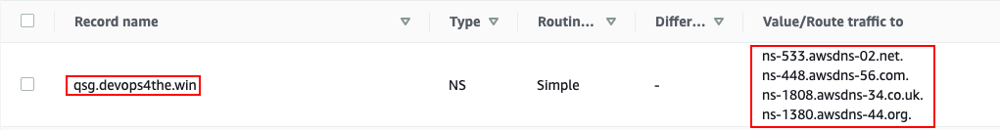
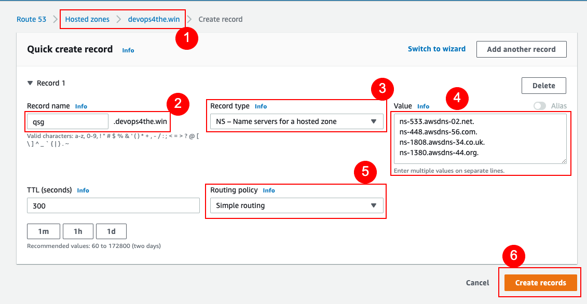

// DarwinJS - I will need to use this from the Quick Start console after soft launch to provide any refinement.

// We need to work around Step numbers here if we are going to potentially exclude the AMI subscription
=== Reference Architecture Compliance
This default configuration will be reference complaint in the number and configuration of instances and setup of SSL and DNS, but it will deploy as small of instances as possible to control costs for a functional POC.  This means it will only be capable of matching published GitLab Reference Architecture benchmarks if you scale the instance resources to match the chosen benchmark.  If you are ready for production scale now (including scaled POCs), please follow the guides indicated below to scale it to your desire initial number of users from the start.

=== Sign in to your AWS account

Deployment takes about {deployment_time} to complete.

. Sign in to your AWS account at https://aws.amazon.com with an IAM user role that has the necessary permissions. For details, see link:#_planning_the_deployment[Planning the deployment] earlier in this guide.
. Make sure that your AWS account is configured correctly, as discussed in the link:#_technical_requirements[Technical requirements] section. 
. Ensure you have or know how to find the resource names, identifiers or arns discussed in the link:#_technical_requirements[Technical requirements] section.

=== Launch the Quick Start

NOTE: You are responsible for the cost of the AWS services used while running this Quick Start reference deployment. There is no additional cost for using this Quick Start. For full details, see the pricing pages for each AWS service used by this Quick Start. Prices are subject to change.

[start=4]
. Choose one of the following options to launch the AWS CloudFormation template. For help with choosing an option, see link:#_deployment_options[Deployment options] earlier in this guide.

[cols=2*]
|===
^|http://qs_launch_permalink[Deploy {partner-product-short-name} into a new VPC on AWS^]
^|http://qs_template_permalink[View template^]

^|http://qs_launch_permalink[Deploy {partner-product-short-name} into an existing VPC on AWS^]
^|http://qs_template_permalink[View template^]
|===

// Adapt the following warning to your Quick Start.
[WARNING]
====
If you’re deploying {partner-product-short-name} into an existing VPC, make sure that your VPC has two
private subnets in different Availability Zones for the workload instances and that the subnets aren’t shared. 
This Quick Start doesn’t support https://docs.aws.amazon.com/vpc/latest/userguide/vpc-sharing.html[shared subnets^]. 

These private subnets require https://docs.aws.amazon.com/vpc/latest/userguide/vpc-nat-gateway.html[NAT gateways^] 
in their route tables to allow the instances to download packages and software without exposing them to the internet. 
Also make sure that the domain name option in the DHCP options is configured as explained in 
http://docs.aws.amazon.com/AmazonVPC/latest/UserGuide/VPC_DHCP_Options.html[DHCP options sets^].  

The Quick Start uses Kubernetes integration with Elastic Load Balancing which requires each private subnet to 
be tagged with `kubernetes.io/role/internal-elb=true` and each public subnet with `kubernetes.io/role/elb=true`.

You provide your VPC settings when you launch the Quick Start.
====

[start=5]
. Check the AWS Region that’s displayed in the upper-right corner of the navigation bar, and change it if necessary. This Region is where the network infrastructure for {partner-product-short-name} is built (or expected to be if deploying into an existing VPC). The template is launched in the {default_deployment_region} Region by default.

[WARNING]
====
Changing the region later will clear all form values.
====

For details on each parameter, see the link:#_parameter_reference[Parameter reference] section of this guide.

Any parameters in the form that are not mentioned below can be left at their default setting.

[start=6]
. On the *Quick create stack* page:
** For `Stack name` set a unique name, but not too long. Note: All resources created will be prepended by this name.
** For `Number of Availability Zones` pick the number that matches your HA requirements and is not more than the selected region has available.
** For `Availability Zones` select at least 2 for non-production and 3 for production.  
** For `SSH key pair name` select an existing keypair in the region. If none exist, you must create one now and specify it here (refresh the browser for the newly created key pair to appear on the list).
** For `Provision a bastion host` select **Enabled**.
** For `Allowed bastion external access CIDR` use the internet to find your own public IP and enter it with a /32 CIDR (e.g. **123.231.123.231/32**)
** `EKS public access endpoint` can stay at the default of `Disabled` if you will use the Bastion host (recommended) for administering the GitLab cluster.
** `EKS node instance type` can remain at the default for non-production and non-performance testing setups. For production or testing setups, https://aws.amazon.com/ec2/instance-types/[select an instance type^] that meets the vCPU and Memory requirements of your chosen reference architecture user level - spread across all EKS nodes you select.
** `EKS node volume capacity` can be left at the default of 100, no GitLab data files of any type are ever stored on these nodes.
** For `Number of EKS nodes` pick a value that when multiplied by the resources of the EKS Node Instance type meets the vCPU and Memory requirements of your chosen reference architecture user level. It should be at least the same as the number of Availability Zones being configured.
** For `Maximum number of EKS nodes` select a number equal to or greater than `Number of EKS nodes`. This limit should reflect what you feel would be excessive scaling that might be caused by factors other than proper load based scaling. 20% higher than `Number of EKS nodes` is a reasonable starting point.
** If you will be using the cluster integrated Grafana for GitLab, for `Configure Grafana` select **Yes**.
** For `GitLab database instance class` select an instance type that fulfills the vCPUs and Memory requirements of PostgreSQL across 3 instances. These must be of the special "db" type and must be specifically available for PostgreSQL as documented in https://docs.aws.amazon.com/AmazonRDS/latest/AuroraUserGuide/Concepts.DBInstanceClass.html[DB Instances Engine Support^].
** For `Database admin password` provide a password that meets the complexity requirements on the Cloud Formation form.
** For `Cache mode` production and performance testing setups must select External to ensure Redis is configured for Elasticache rather than placed in the EKS cluster. Redis in the EKS cluster is not currently supported by GitLab Reference Architecture.
** For `Number of cache replicas` enter the number that matches the availability zones you are configuring for.
** `Cache node type` can remain at the default for non-production and non-performance testing setups. For production or testing setups, specify the Cache instance node type. These must be of the special instance type "cache". https://aws.amazon.com/elasticache/pricing/[Cache Instance Type List^].
** For `GitLab DNS Name` select a subdomain to which the gitlab host ("gitlab") will be a part of, but do not specify the gitlab host name.  For example `devopstools.ourcompany.com` creates a gitlab instance at `gitlab.devopstools.ourcompany.com`
** For `Create Route53 hosted zone` select **Yes.**
** For `Request AWS Certificate Manager SSL certificate` select **Yes**.
** For `Outgoing SMTP domain` select **CreateNew**.
** For `GitLab Helm chart version` pick a version from https://docs.gitlab.com/charts/installation/version_mappings.html[GitLab version mappings^].
** For `GitLab application version` select the corresponding GitLab version for the chart version that was picked from https://docs.gitlab.com/charts/installation/version_mappings.html[GitLab version mappings^].
** For `Number of Gitaly replicas` set it the same as the number of Availability Zones being configured.
** For `Gitaly instance type`, https://aws.amazon.com/ec2/instance-types/[select an instance type^] that meets the vCPU and Memory requirements of your chosen reference architecture user level.
** For `Gitaly volume capacity` - this is used for Git Repository storage and working and cache storage for Gitaly. Remember that overprovisioning storage size gives more IOPs on AWS. You may also elect to pay for higher IOPs levels. https://docs.aws.amazon.com/AWSEC2/latest/UserGuide/ebs-volume-types.html[See EBS docs^]. Gitaly uses a lot of working storage and cache storage, so do at least double of your 1-2 year Git repository storage projection.
** For `Number of Praefect replicas` set it the same as the number of Availability Zones being configured.
** For `Praefect instance type`, https://aws.amazon.com/ec2/instance-types/[select an instance type^] that meets the vCPU and Memory requirements of your chosen reference architecture user level.
** For `Quick Start S3 bucket region` select **us-east-1** (this does not need to match the region you are deploying to)
** **Check** `I acknowledge that AWS CloudFormation might create IAM resources with custom names.`
** **Check** `I acknowledge that AWS CloudFormation might require the following capability: CAPABILITY_AUTO_EXPAND`

NOTE: Unless you are customizing this Quick Start's templates for your own deployment projects, we recommend that you keep the default settings for the parameters labeled `Quick Start S3 bucket name`, `Quick Start S3 bucket
Region`, and `Quick Start S3 key prefix`. Changing these parameter settings automatically updates code references to point to a new Quick Start location. For more information, see the https://aws-quickstart.github.io/option1.html[AWS Quick Start Contributor’s Guide^].

[start=9]
. Choose *Create stack* to deploy the stack.

[WARNING]
====
If you did not specify a CreateSslCertificate = Yes, then skip this section.
====

NOTE: If you choose Yes for both `Create Route53 hosted zone` and `Request AWS Certificate Manager SSL certificate`, you will need to create a delegated DNS subdomain **WHILE THE STACK IS RUNNING** Follow these steps to be sure your stack does not fail. In order to ensure the stack completes successfully, this should be done within 1 hour of the ACM process entering a wait state.

The waiting period starts when the child stack containing "...GitLabStack...Infrastructure..." is waiting for creation of a resource called "SslCertificate"

These steps can be completed as soon as the subdomain Hosted Zone is created in Route53 - this happens well ahead of the ACM certificate wait state (which will not occur if you do these steps as soon as the hosted Zone is created).

NOTE: There will be both a **Public** and a **Private** hosted zone created for your subdomain - it is important to obtain the nameserver records from the **Public hosted zone**.

[start=1]
. Monitor Route53 for the creation of a Hosted Zone with the domain you specified for `GitLab DNS Name` (For this example we will use `devopstools.ourcompany.com`).
. In the [*AWS Route53 console*](https://console.aws.amazon.com/route53/v2/hostedzones#), find the new hosted zone's *Public* recordset for the subdomain and **copy it's nameservers list**.
In the screenshot "qsg.devops4the.win" is the hosted zone created by the QuickStart - copy the "Value/Route traffic to".

[start=2]
. Edit the DNS records of the primary domain and add an NS record for the subdomain to point to the DNS servers. This is done in whatever system hosts the root domain's primary name server records. (For this example that would be `ourcompany.com`)

NOTE: This article discusses how to do it when the root domain DNS is also in Route53: [Creating a subdomain that uses Amazon Route 53 as the DNS service without migrating the parent domain](https://docs.aws.amazon.com/Route53/latest/DeveloperGuide/CreatingNewSubdomain.html)

In the screenshot "devops4the.win" is the root DNS domain and is hosted in Route53.

NOTE: Not all domain registrars have the ability to create NS records for hosted zones ("subdomain DNS delegation"). If this is the case for your registrar, then you have the option to redirect the root domain to AWS for DNS and then use Route53 to create the subdomain DNS delegation. 

[start=3]
.  If your stack is actually waiting on this change, be very patient for DNS to propagate and for AWS ACM to attempt to validate the domain again.  With all possible DNS propagation CloudFormation status update delays, this could take over an hour.

[An issue has been created](https://github.com/aws-quickstart/quickstart-eks-gitlab/issues/37) to improve this experience by allowing a host to be inserted into an existing AWS hosted zone.

==== Setting Client Based Up Name Resolution for Non-Custom Domain Setups

When you do not specify DomainName the QuickStart creates a random subdomain and hosted zone that can be used in your hosts file to access your instance.

. In the *AWS Systems Manager* console and click on *(https://console.aws.amazon.com/systems-manager/parameters/[Parameter Store^])*. 
. In the search field, type **/infra/domain-name** to locate the parameter and copy the value to a temporary location.
. In the *AWS Systems Manager* console and click on *(https://console.aws.amazon.com/systems-manager/parameters/[Parameter Store^])*.
. In the search field, type **/loadbalancer** to locate the parameter and copy the value to a temporary location.
. Use nslookup in a console to get any one of the load balancer's ip addresses and and copy the value to a temporary location.
. Edit your local hosts file to add the ip address pointed at the host name (swap out 111.111.111.111 with the IP address from above).  Note "gitlab" added to the beginning. Replace **full.subdomainname.from.parameterstore** with your value.

----
111.111.111.111 gitlab.*full.subdomainname.from.parameterstore*
----

[WARNING]
====
Over the course of time, the load balancer may retire this IP address - if this happens, repeat these steps to get an active load balancer IP to update the /etc/hosts file with.
====